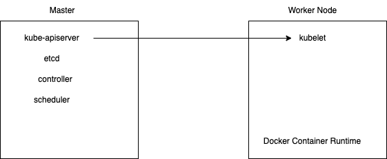

# Unit 1 - Core Concepts

## Kubernetes Architecture

**Node** is a machine (physical or virtual) on which Kubernetes is installed.  A node is a worker machine in Kubernetes. It was known as minions in the past. Even there is another name called Worker Node. Therefore, name is interchangeable.  Each node has the services necessary to run pods and is managed by the control plane.  The services on a node include the container runtime, kubelet and kube-proxy.

If one node fails our application will fail. To prevent this, we could have multiple nodes. Then a **cluster** is a set of nodes grouped together. If one node fails the application will still be running on the other nodes. Apart from resilience, multiple nodes also provide load balancing.

**Master** is a node that controls the cluster. It is the entry point for all administrative tasks. It is responsible for managing the cluster. The master can be a single node in the cluster or multiple nodes for high availability. Master knows the state of all nodes in the cluster, it schedules applications, scales applications, and rolls out updates.

When kubernetes is installed in one node, it contains intalled:

* API Server: Exposes the Kubernetes API. It is the front end of the Kubernetes control plane.
* Scheduler: Assigns workloads to nodes.
* Controller: Monitors the state of the cluster and makes changes so that the current state matches the desired state.
* etcd: Consistent and highly-available key value store used as Kubernetes' backing store for all cluster data. It's responsible for implementing locks and leader election to prevent conflicts between masters.
* kubelet: An agent that runs on each node in the cluster. It makes sure that containers are running in a pod.
* Container Runtime: Software that is responsible for running containers. By default, it is Docker, but it can be changed to containerd, CRI-O, etc.

In the following image it's shown the difference between master and a worker node:

**kubectl** is the tool used to manage Kubernetes. It is a command line interface for running commands against Kubernetes clusters. You can use kubectl to deploy applications, inspect and manage cluster resources, and view logs.

## Docker vs ContainerD

In the following section, we are going to check the differences between Docker and ContainerD.

There are several command used like ctr, nerdctl, crictl, etc. But the most common is ctr.

At the beginning Docker and Kubernetes were the dominant couple. Kubernetes become more popular and it was demanded to support other container runtimes. 

To decouple Kubernetes from Docker it was created CRI (Container Runtime Interface). It is a plugin interface which enables kubelet to use a wide variety of container runtimes, without the need to recompile. It means that Kubernetes can use any container runtime that supports CRI without any modification. CRI acts as an abstraction layer between kubelet and the container runtime.

Any container runtime adhered to OCI initiative is going to be supported by CRI.

However, Docker was nos supported by CRI. Then, to keep Kubernetes supporting Docker, it was created **dockershim**. It is a plugin that allows kubelet to use Docker as a container runtime. But it was deprecated in Kubernetes 1.20.

Docker contains **containerd** daemon which support CRI. Therefore, it is possible to use **containerd** as a container runtime in Kubernetes.

Therefore, ContainerD was created. It is a container runtime that is available as a daemon for Linux and Windows, which can manage the complete container lifecycle of its host system: image transfer and storage, container execution and supervision, and low-level storage and network attachments.

These are the main differences between Docker and ContainerD:

1. Docker:  
   1. Full container platform.
   2. Includes container runtime, image building, and orchestration tools. 
   3. Uses dockershim to interface with Kubernetes (deprecated in Kubernetes 1.20). 
2. ContainerD:
   1. Lightweight container runtime. 
   2. Focuses on managing the container lifecycle (image transfer, storage, execution, supervision). 
   3. Supports CRI (Container Runtime Interface) natively. 
   4. Can be used independently or as part of Docker.

### ContainerD Architecture

ContainerD contains a not very friendly CLI command called **ctr**. It is a client for the containerd daemon. It is used to control the containerd daemon and interact with the containerd API.

TBC
